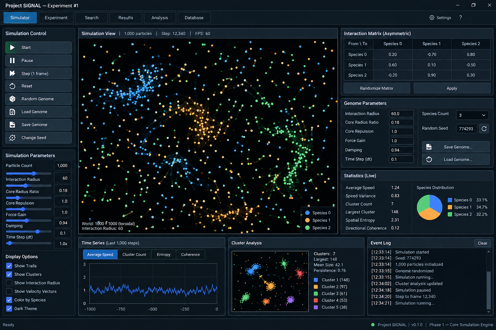

# Project SIGNAL

Project SIGNAL is a reproducible research platform for testing whether very simple, local particle interactions can organize into structures that transmit a measurable perturbation.

> Project SIGNAL searches for reproducible emergent behavior. A high-scoring simulation is a research candidate, not evidence of a new law of physics, life, intelligence, or computation until independently analyzed and reproduced.



*Dashboard reference: the simulator keeps the particle field central while exposing controls, genome parameters, live statistics, time series, cluster analysis, and the event log.*

## What is included

| Area | Capability |
|---|---|
| Simulator | Seeded 2D toroidal particle universe with editable genome parameters |
| Rendering | Tkinter dashboard plus GPU-backed Three.js particle view with fullscreen mode |
| Structure detector | Cluster identity, cohesion, shape, dynamics, lifetime, bridge, and raw graph metrics |
| Network detector | Dense-region nodes, persistent pathway edges, topology tracking, network score, and replay snapshots |
| Experiments | Eight-case detector calibration and independent Experiment 001 baseline search |
| Results | SQLite database, CSV, JSON, Markdown, Excel, PDF, and replayable candidate snapshots |

The implementation deliberately keeps the physics engine, signal injection, and evolutionary optimization separate from the detector and baseline-search layers.

## Phase 1

This repository currently implements the Phase 1 deterministic simulation core:

- a 2D toroidal world;
- three-species particle states;
- asymmetric interaction genomes;
- smooth attraction/repulsion forces with universal core repulsion;
- a uniform-grid spatial hash;
- deterministic seeded initialization and reset;
- JSON genome and compressed particle-state persistence;
- a simple Tkinter real-time viewer.

Phase 2A/2B now adds persistent-structure detection, stable cluster identity tracking, cohesion-aware structure scoring, deterministic synthetic validation, replayable structure snapshots, and an independent, non-optimizing Experiment 001 baseline search. Signal injection and evolutionary optimization remain intentionally out of scope.

## Installation

Python 3.12+ is recommended. Phase 1 requires NumPy. Tkinter is included with most Windows Python distributions.

```powershell
py -3 -m pip install -r requirements.txt
```

For development tests:

```powershell
py -3 -m pip install -e ".[dev]"
```

## Run the simulator

```powershell
py -3 -m signal_lab.cli.simulate
```

The viewer starts paused. Use Start/Pause, Step, Reset, Randomize Genome, and the seed field to explore deterministic universes. Save Universe writes a genome and particle state to a selected directory; Load Universe restores both.

The `Three.js Particle View` button opens a companion WebGL view in the default browser. It uses GPU-backed `THREE.Points` and `BufferGeometry` to render the live Python state with glowing species colors, depth from particle speed, cluster rings, a world grid, orbit drag, and zoom. The browser needs internet access to load the pinned Three.js module from jsDelivr; the Tkinter dashboard remains available as the offline fallback.

### Dashboard controls

- Use `F11` or the fullscreen control to expand the simulation view.
- Use the existing `Structure Debug` option to expose detector overlays in the desktop canvas.
- In the Three.js view, toggle `NETWORK DEBUG` to show dense-region outlines, node labels, centroid markers, and highlighted network edges.
- Click a cluster ring for cluster metrics or click a network node for network and node metrics.

## Physics

Each particle has only an id, species, position, and velocity. For each nearby particle, the engine uses minimum-image toroidal distance. Within the core radius, particles receive universal repulsion. Outside the core, the signed interaction matrix value is smoothly shaped by a sine envelope. The matrix entry is directional: `A[i][j]` controls the force felt by species `i` from species `j`.

The spatial hash uses cells the size of the interaction radius and searches the current cell plus the eight neighboring cells. Neighbor traversal is sorted to keep results reproducible across runs.

The simulation batches all discovered directed neighbor forces into NumPy arrays each step. This preserves the force equations while avoiding a separate Python/NumPy call for every pair. Headless search also performs no rendering; use a larger `--observation-interval` when exploratory speed matters and reduce it for final measurements.

## Determinism

The initial state is generated from an explicit seed. Resetting an engine regenerates the same state and simulation steps are deterministic for a fixed genome, seed, and initial state. Save/load round trips preserve the complete particle arrays.

## Experiment 001 baseline search

Run the first headless search with:

```powershell
py -3 -m signal_lab.cli.search --runs 1000 --steps 5000 --particles 1000 --observation-interval 10
```

For a shorter smoke run:

```powershell
py -3 -m signal_lab.cli.search --runs 1 --steps 20 --particles 50 --min-cluster-size 3 --observation-interval 10
```

Experiment 001 is stored in `results/experiment_001_baseline/` as a preserved SQLite database plus `experiment_001_baseline.csv`, `experiment_001_baseline.json`, and `experiment_001_summary.md`. Every completed or failed genome gets a summary row. Complete snapshots are saved only for qualifying primary candidates under the experiment's `structures/` directory. Re-running with the same configuration safely resumes completed work; a different configuration is rejected so Experiment 001 cannot be overwritten.

The dashboard's Search and Results buttons open the corresponding controls and result table. Search progress includes completed genomes, simulation steps, elapsed and estimated remaining time, candidate count, and best structure score. Results are loaded from the baseline database, can be sorted by the detector metrics, and double-clicking a candidate loads its saved replay.

The batch launcher [run_search.bat](run_search.bat) exposes the same three primary experiment-size settings near the top of the file:

```bat
set RUNS=1000
set STEPS_PER_RUN=5000
set PARTICLES=1000
```

The Search window exposes these as editable `Genomes / runs`, `Steps per genome`, and `Particles / universe` fields. Settings changed while a search is active apply to the next search after the current one is stopped or completed.

## Export results

Use `Export Results...` in the simulator control panel or the Results window, choose an output folder, and the dashboard writes:

- `project_signal_export.xlsx` with Summary, Genome, Matrix, Clusters, Cluster History, Time Series, Events, Particles, and Search Results worksheets;
- `project_signal_report.pdf` with a shareable run summary, detected structures, search results, and event log;
- `project_signal_export.json` containing the complete serialized export snapshot;
- separate CSV files for each table.

Install the requirements once before using Excel export:

```powershell
py -3 -m pip install -r requirements.txt
```

## Detector calibration validation

Run the deterministic synthetic validation suite before starting a large search:

```powershell
py -3 -m signal_lab.cli.validate_structures
```

The suite covers compact moving blobs, bridged blobs, random clouds, expanding clouds, frozen crystals, internal circulation, crossing structures, and toroidal boundary crossing. It reports raw cohesion, identity, shape, dynamics, connectivity, bridge, and temporal metrics.

Detector classifications and primary-candidate thresholds are configuration-backed in `configs/default.toml`. Macro clusters have more than 300 particles and remain measurable, but cannot qualify as Experiment 001 primary candidates. The validation report preserves expected versus actual behavior and the raw detector metrics for all eight cases.

## Network structure detection

The network layer builds a configurable toroidal particle graph inside each connected cluster, preserves raw graph metrics, extracts dense regions as nodes, and tracks node identity and pathway edges over time. It classifies internally organized structures as `NETWORK_STRUCTURE`, large unorganized populations as `MACRO_AGGREGATE`, and compact non-network structures as `COMPACT_STRUCTURE`. No signaling or perturbation is included.

Run the eight deterministic network checks with:

```powershell
py -3 -m signal_lab.cli.validate_networks
```

Qualifying network replays are written to `results/networks/` with the genome, seed, complete particle state, node definitions, edge definitions, topology history, and raw metrics. The Three.js viewer's `NETWORK DEBUG` control displays node regions, node labels, centroid markers, and highlighted network edges; clicking a node shows both network and node metrics.

## Scientific scope

Phase 1 provides mechanics for later experiments; it does not claim that visually interesting behavior is communication, computation, life, or novelty. Future phases must retain raw measurements, controls, seeds, configuration, and complete replays.

## Repository layout

```text
configs/default.toml                 Detector and experiment thresholds
signal_lab/physics/                  Particle state, forces, genome, spatial hash
signal_lab/experiment/clustering.py  Cluster detection and temporal identity
signal_lab/experiment/networks.py    Internal graph, nodes, edges, network score
signal_lab/search/runner.py          Append-safe Experiment 001 search
signal_lab/storage/replay.py         Structure and network replay snapshots
signal_lab/ui/simulator_view.py      Existing Tkinter dashboard
signal_lab/ui/three_viewer.py        Companion Three.js WebGL viewer
tests/                               Physics, detector, network, export, and baseline tests
docs/images/                         README screenshots and visual references
```

## Validation status

The checked-in reports are generated from deterministic synthetic fixtures:

- [Structure detector validation](validation_report.txt): 8/8 tests passed.
- [Network structure validation](network_validation_report.txt): 8/8 tests passed.

Run the complete automated suite with:

```powershell
py -3 -m unittest discover -s tests -q
```
